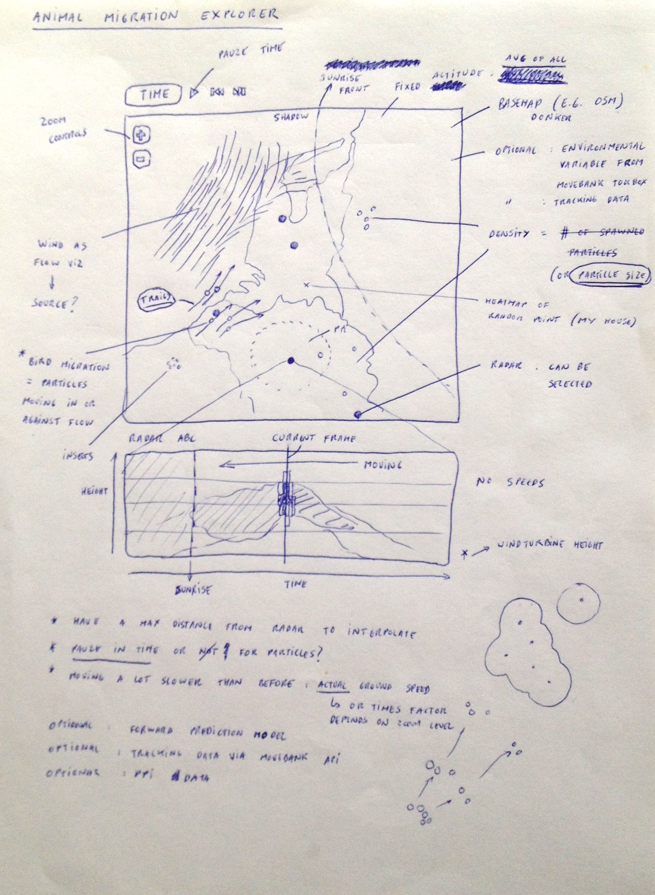

```{r setup, include=FALSE}
knitr::opts_chunk$set(echo = TRUE)
```

## Audience

The target audience for this document are ENRAM researchers and developers. The target audience for the envisioned explorer are (animal movement) researchers.

## Rationale

The [European Network for the Radar Surveillance of Animal Movement (ENRAM)](http://enram.eu/) is an Action initiated by the [COST Programme](http://cost.eu/) (European Cooperation in Science and Technology) from October 2013 until October 2017. Its goal is to better understand animal migration at a European scale by making use of a network of weather radars. Visualizations are an essential tool for researchers to explore the data this network will generate and to compare those with environmental data.

This document is a summary of discussions and ideas by Working Group 3 (Visualizing Spatio-temporal Patterns of Animal Movement) of ENRAM, regarding features we want in those visualizations. For each feature, we list short-, mid- and long-term goals; goals in green have been achieved. We hope this document can serve as a roadmap for the development of these features, which - ideally - can happen as contained projects that contribute to a unified animal migration explorer and/or several specific visualization tools.

## Initial sketch



## Data requirements

### Bird migration altitude profile data

Data = bird migration altitude profiles automatically derived from weather radar data. Ideally, these data are accessible as **open data**.

* ~~**Short-term**~~: Data from spring 2013 migration case study, covering 5 radars (from Belgium and the Netherlands) over 7 days. This dataset is available at https://github.com/enram/case-study/tree/master/data/bird-migration-altitude-profiles.
* **Mid-term**: Data from a migration case study within the northwest flyway incorporating data from more than 5 operational weather radars from three or more countries.
* **Long-term**: Near real-time data, covering all of Europe.

### Insect migration altitude profile data

Data = insect migration altitude profiles automatically derived from weather radar data. Ideally, these data are accessible as **open data**.

* **Short-term**: -
* **Mid-term**: Improvements of bird algorithm will also derive insect data.
* **Long-term**: Near real-time data, covering all of Europe (= entire OPERA network).

### Radar location data (open data)

* ~~**Short-term**~~: Radar locations (5) covering the spring 2013 migration case study. This dataset is available at https://github.com/enram/case-study/tree/master/data/radars.
* **Mid-term**: Radar locations covering the mid-term migration case study. This information will be available as metadata in the HDF files for the bird data. Once developed, easy to apply for long-term too.
* **Long-term**: Radar location covering all of Europe (= entire OPERA network).

### Basemap data (open data)

The basemap would show country/lake borders, potentially topography such as mountain ranges.

* ~~**Short-term**~~: Basemap covering the spring 2013 migration case study. This dataset is available at https://github.com/enram/case-study/tree/master/data/basemap.
* ~~**Mid-term**~~: Basemap covering the migration case study. This dataset can be derived from https://github.com/enram/case-study/tree/master/data/basemap.
* ~~**Long-term**~~: Basemap covering all of Europe. This dataset can be derived from https://github.com/enram/case-study/tree/master/data/basemap.

### Wind data (open data)

Data = u and v wind components at several pressure levels, preferably from a homogenous dataset such as gridded reanalysis data or deterministic model output (e.g. NCEP reanalysis data, ERA-interim, ECMWF high resolution model)

* **Short-term**: Wind data covering the spring 2013 migration case study.
* **Mid-term**: Wind data covering the mid-term migration case study.
* **Long-term**: Near real-time wind data covering all of Europe.

## Features

### Map

#### Basemap

The basemap should be styled in light grey (e.g. [Positron](http://content.stamen.com/files/cartodb-squares-positron.jpg)), to easily render visualizations on top and display the visualization in bright rooms (e.g. for presentations).

* ~~**Short-term**~~: Vector data showing contours of countries and lakes.
* **Mid-term**: OpenStreetMap data, highlighting mountains and water bodies.
* **Long-term**: Same as mid-term goal.

#### Map zooming and panning

* ~~**Short-term**~~: Fixed map covering use case area.
* ~~**Mid-term**~~: Fixed map covering use case area. Switching between use cases reloads map.
* **Long-term**: Map covers all of Europe, at which point it becomes interesting to allow zooming and panning.

#### Data selection

* ~~**Short-term**~~: The user cannot select a dataset, it is predefined (e.g. a case study).
* **Mid-term**: The user can select the start date and a fixed period (e.g. one week) of data is loaded.
* **Long-term**: The user can select the start and end date in the data.

### Time

#### Time indication

* ~~**Short-term**~~: The UTC date and time of the visualized data is indicated. This datetime is updated automatically if the visualization is progressing.
* ~~**Mid-term**~~: Same as short-term goal.
* ~~**Long-term**~~: Same as short-term goal.

#### Time selection

* ~~**Short-term**~~: The user can select a certain time interval to start the visualization from using a text box.
* ~~**Mid-term**~~: Same as short-term goal.
* ~~**Long-term**~~: Same as short-term goal.

#### Time navigation

* ~~**Short-term**~~: The user can navigate through time using forward and backward buttons.
* **Mid-term**: The user can navigate through time by dragging a slider.
* **Long-term**: Same as mid-term goal.

#### Play/pause time progression

* ~~**Short-term**~~: The user can start and pause the progression through time.
* ~~**Mid-term**~~: Same as short-term goal.
* ~~**Long-term**~~: Same as short-term goal.

### Bird migration as a flow on the map

#### Interpolation

* ~~**Short-term**~~: Data are interpolated using a pixel grid.
* **Mid-term**: Data are interpolated more efficiently by using a larger grid (e.g. 5 pixels) and/or by precalculating certain aspects of the interpolation (e.g. radar contributions).
* **Long-term**: Data are interpolated using a coordinate grid (e.g. by 0.5 degrees). The interpolation is now independent of screen size, but depends on what area is covered.

#### Direction and speed (interpolation)

* ~~**Short-term**~~: Direction and speed of the migration are interpolated over the whole area as two-dimensional vectors. The resulting animation speed is arbitrary.
* **Mid-term**: The animation speed approximates the actual ground speed (but animated faster because e.g. 20 minutes are shown in 1 second).
* **Long-term**: The animation speed is the actual ground speed: it scales with the map, but the user can speed up the animation (x10, x25 or x100).

#### Altitude (aggregation)

* ~~**Short-term**~~: The data are aggregated in altitude bands, but only one band is shown at the time.
* ~~**Mid-term**~~: Same as the short-term goal.
* **Long-term**: Multiple bands are shown at the time, on top of each other or next to each other. Or user can select level of aggregation.

#### Density (interpolation)

* **Short-term**: -
* **Mid-term**: Density information is interpolated and expressed as a heatmap with a legend.
* **Long-term**: Density information is expressed as thicker lines, more particles or as circles around radars.

#### Radar contribution

* **Short-term**: -
* **Mid-term**: Radars are highlighted if they contribute data to the visualization (e.g. other colour or circled).
* **Long-term**: Same as mid-term goal.

#### Click to see interpolated data

* **Short-term**: -
* **Mid-term**: In pause modus, the user can click on any area of the map (including a radar) to see a popup/side panel with the current values for u_speed, v_speed and density. The popup/side panel can be closed. See [Earth](https://earth.nullschool.net/#current/wind/surface/level/orthographic/loc=18.281,21.505) for an example.
* **Long-term**: That information is available and updated automatically when the animation is in play modus. In addition, the selected location could be stored in the URL (cf. Earth).

#### Clipping of interpolated area

* **Short-term**: The interpolated area does not cover the whole map, but is clipped at a certain pixel distance from the radar. This creates a visualization similar to figure 3 in [this report](http://www.enram.eu/wp-content/uploads/2014/02/STSM-report-leijnse.pdf).
* **Mid-term**: The interpolated area is at a fixed real-world distance from each radar.
* **Long-term**: Same as mid-term goal.

#### Insect migration

* **Short-term**: -
* **Mid-term**: -
* **Long-term**: Insect migration is visualized in the same way as bird migration. The user can switch between the two groups or show them together (with distinctive colours).

### Overview time chart

* **Short-term**: Below the map, a chart shows the average density or direction across all radars as a line (y-axis) for the whole selected period (e.g. one week, on x-axis). Minimum and maximum values are indicated as well (area is shaded between those). A vertical line indicates the current time. When the animation is in play modus, this line moves over the chart. Note that this type of animation is in different from the bird density height profile (below), which itself moves to the left (as it does not cover a whole week).
* **Mid-term**: Same as short-term goal.
* **Long-term**: The user can navigate through time by dragging the line. See also "Time navigation". Special attention has to be paid to combine the navigation aspect with the information aspect, to create a satisfying UX.

### Bird density height profile per radar

* **Short-term**: -
* **Mid-term**: In pause modus, the user can click on a radar to see its bird density height profile below the map (cf. [FlySafe](http://www.flysafe-birdtam.eu/profile.php?radar=denhelder) profiles). This profile is calculated dynamically and covers a 48h period (36h past/12h future).
* **Long-term**: The bird density height profile progresses through time (moves to the left) at the same speed as the flow visualization, when the animation is in play modus.

### Sunrise/sunset information

#### On map

* **Short-term**: -
* **Mid-term**: In pause modus, a shaded area on the map indicates where it is night. The borders of the area are coloured differently to indicate twilight and dawn.
* **Long-term**: The shaded area moves over the map when the animation is in play modus.

#### On bird density height profile

* **Short-term**: -
* **Mid-term**: In pause modus, a shaded area on the bird density height profile (if active) indicates where it is night. The borders of the area are coloured differently to indicate twilight and dawn (cf. [FlySafe](http://www.flysafe-birdtam.eu/profile.php?radar=denhelder) profiles).
* **Long-term**: The shaded area moves to the left with the bird density height profile, when the animation is in play modus.

### Wind

Inspiration: http://422.com/work/america-revealed-ep.-3-wind-patterns-across-the-us and http://earth.nullschool.net/, but also https://www.ventusky.com/.

* **Short-term**: -
* **Mid-term**: Wind speed and direction from a specific, fixed pressure level is retrieved for fixed locations on the grid (e.g. every 0.5 degrees) and visualized as anchored two dimensional vectors. These vectors have a different colour than the flow visualization. These vectors change direction and length when the animation is in play modus and have the same scale as the bird speeds.
* **Long-term**: The pressure level for which wind data are retrieved depends on the selected altitude band or user can select which pressure level to show.

### Temperature

Useful for insect migration.

* **Short-term**: -
* **Mid-term**: In pause modus, temperatue is shown as a heatmap (cf. [Earth](https://earth.nullschool.net/#current/wind/surface/level/overlay=temp/orthographic)).
* **Long-term**: The heatmap changes when the animation is in play modus.
